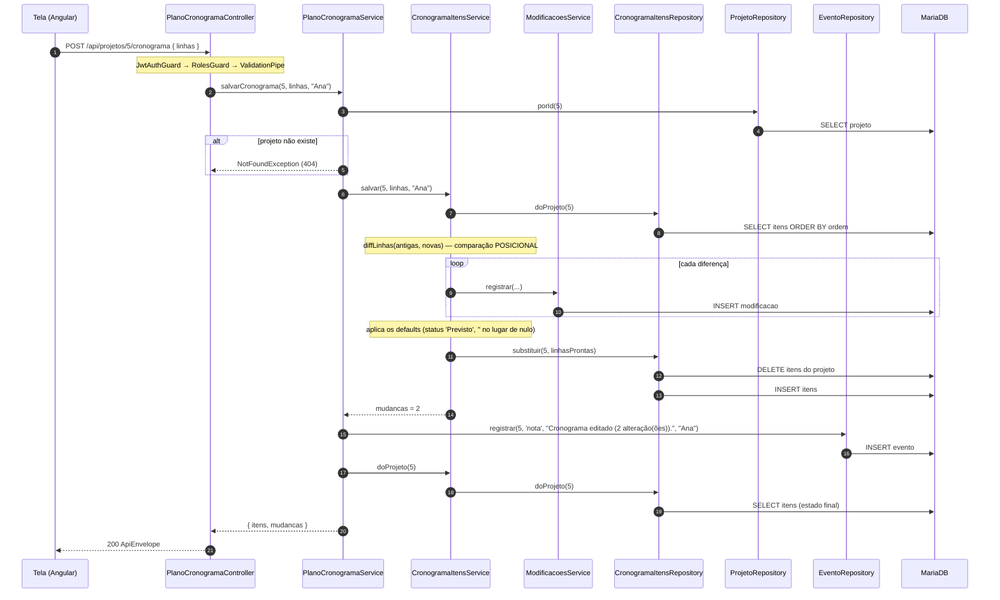
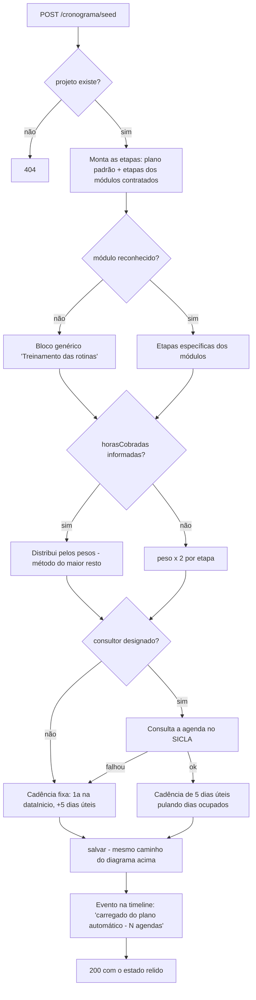

# Fluxo — `plano-cronograma`

## Salvar o Cronograma, ponta a ponta

## Carregar o plano automático (seed)

## Onde cada decisão acontece

| Decisão | Camada | Arquivo |
|---|---|---|
| Autenticação, perfil, forma do payload | Controller (guards/pipe) | `plano-cronograma.controller.ts` |
| 404 de projeto inexistente | Service | `plano-cronograma.service.ts` |
| Registrar na timeline | Service | `plano-cronograma.service.ts` |
| Reler o estado antes de responder | Service | `plano-cronograma.service.ts` |
| Diff e contagem de mudanças | Service de recurso | `cronograma-itens.service.ts` |
| Defaults por campo | Service de recurso | `cronograma-itens.service.ts` |
| Datas, dias úteis, distribuição de horas | Utils puros | `datas-plano.util.ts`, `cronograma-itens.service.ts` |
| `DELETE` + `INSERT` | Repository | `repositories/cronograma-itens.repository.ts` |
