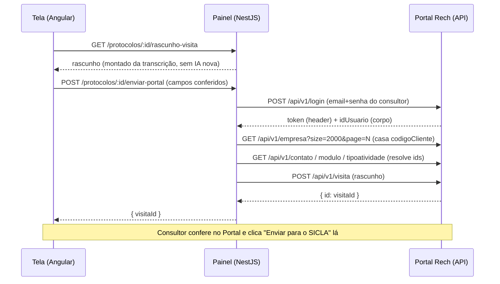

# Integração com a API do Portal Rech — guia de uso

> **Público:** qualquer pessoa/sistema que precise criar um "Registro de Atendimento em
> Visita" (o *protocolo* do Portal) por API, sem digitar tudo à mão no site.
> **Status:** funcionando em produção — contrato validado com envios reais em 2026-08-13/14.
> **Fonte do contrato:** o Portal **não tem documentação oficial de API**. Tudo aqui foi
> inferido do bundle JavaScript do app (`portalrech.com.br` = "SIGER® Web - Clientes") e
> confirmado nos primeiros envios reais. Se o Portal mudar, é este documento e o
> [`portal-rech.service.ts`](../portal-rech.service.ts) que precisam acompanhar.

## Visão geral

O navegador **nunca fala direto** com a API do Portal — quem fala é o backend do Painel,
autenticado com a credencial do próprio consultor. A visita é criada como **rascunho**;
o envio ao SICLA continua sendo um clique do consultor dentro do Portal (decisão de
2026-08-13: abrir pré-preenchido para conferir, nunca enviar automático).



---

## Parte 1 — Contrato da API do Portal Rech

### Base e versão

```
https://portalrech.com.br/api/v1/
```

⚠️ O segmento **`v1/` faz parte do caminho de TODAS as rotas** (login inclusive). O bundle
monta `hostWebservice("…/api/") + "v1" + "/"`. Sem o `v1/`, o login cai em `/api/login` e o
gateway devolve **401 mesmo com credencial certa** — foi a primeira pegadinha do envio real.

### Autenticação

```http
POST /api/v1/login
Content-Type: application/json

{ "email": "consultor@rech.com.br", "senha": "…", "mantemLogado": false }
```

- O campo validado é **`email`** — mandar só `login` dá `400 "Campo email não informado"`.
- **Token de sessão**: volta no header de resposta **`Rech-Portal-Token-Autenticacao`**, já
  com o prefixo `Bearer `. Nas chamadas seguintes, mande esse valor **inteiro** no header
  `Authorization`.
- **Corpo da resposta**: traz o usuário logado — `{ "id": 123, … }`. Guarde esse `id`
  (**idUsuario**): ele é **obrigatório** no POST da visita (sem ele: 503 `id must not be null`).

### Convenções de listagem/busca

| Convenção | Detalhe |
|---|---|
| Formato de lista | Array puro **ou** página Spring `{ "content": [...] }` — trate os dois |
| Paginação | `?size=N&page=N` (base 0). Limite prático: **2000 por página** |
| Filtro (DSL própria) | `?search=<campo> <op> <valor>` com operadores `eq` / `neq` / `ct` (contém). Ex.: `contato?search=empresa.id eq 2896` |

### Endpoints usados na integração

| Endpoint | Para quê | Como casar |
|---|---|---|
| `GET empresa?size=2000&page=N` | Achar o `idEmpresa` do cliente | `codigoCliente` == código do cliente no SICLA (rótulo no Portal: "Código no SICLA / Nº do projeto"); fallback por `razaoSocial`/`nomeFantasia`. Paginar até achar |
| `GET contato?search=empresa.id eq {idEmpresa}` | Contato do atendimento (**obrigatório**) | Prefira `status != 'I'`; case pelo nome ou pegue o primeiro |
| `GET modulo` | Módulo da atividade (**obrigatório**) | Case pela `descricao` (contém, nos dois sentidos) ou pegue o primeiro |
| `GET tipoatividade?search=status eq A` | Tipo de atividade (opcional, mas preencher evita o "Selecione um tipo") | Primeiro ativo |
| `POST visita` | Criar o registro (rascunho) | Ver payload abaixo |

### `POST /api/v1/visita` — o payload

```json
{
  "idUsuario": 123,
  "idContato": 456,
  "idEmpresa": 2896,
  "dataInicioVisita": "2026-08-13T08:00:00",
  "dataFimVisita": "2026-08-13T12:00:00",
  "dataInicioDeslocamento": "2026-08-13T07:00:00",
  "dataFimDeslocamento": "2026-08-13T13:00:00",
  "custoPedagio": 0,
  "custoEstadia": 0,
  "custoAlimentacao": 0,
  "custoEstacionamento": 0,
  "kmInicial": null,
  "kmFinal": null,
  "acoesVisita": [
    {
      "idModulo": 7,
      "idTipoAtividade": 2,
      "idContato": 456,
      "nomeContato": "Iloni",
      "idUsuario": 123,
      "descricao": "- PARTICIPANTES:\n…\n\n- ROTINAS:\n…\n\n- TAREFAS/OBSERVAÇÕES:\n…"
    }
  ]
}
```

Resposta: `{ "id": <visitaId>, … }`. A visita nasce como **rascunho** no login do usuário
autenticado — "Enviar para o SICLA" é outro passo, manual, dentro do Portal.

**Armadilhas confirmadas nos envios reais (2026-08-13):**

1. No **topo** da visita, `idUsuario`, `idContato` e `idEmpresa` são **obrigatórios** —
   faltando qualquer um: `503 "id must not be null"` (o erro não diz qual campo).
2. Na atividade (`acoesVisita[0]`), o campo do texto é **`descricao`** — NÃO
   `descricaoAtividade` (o nome que aparece na tela do Portal engana).
3. `idModulo` e `idContato` da atividade também são obrigatórios (nulos: mesmo 503).
4. Datas no formato `YYYY-MM-DDTHH:MM:SS` (um `datetime-local` + `:00` serve).

### Exemplo completo em `curl`

```bash
BASE=https://portalrech.com.br/api/v1

# 1. Login — token no HEADER, idUsuario no corpo
curl -si "$BASE/login" -H 'Content-Type: application/json' \
  -d '{"email":"consultor@rech.com.br","senha":"…","mantemLogado":false}'
# → header:  Rech-Portal-Token-Autenticacao: Bearer eyJ…   → use como Authorization
# → corpo:   {"id":123,…}

TOKEN='Bearer eyJ…'

# 2. Empresa pelo código do SICLA (paginar se precisar)
curl -s "$BASE/empresa?size=2000&page=0" -H "Authorization: $TOKEN"

# 3. Contato da empresa / módulos / tipo de atividade
curl -s "$BASE/contato?search=empresa.id%20eq%202896&size=2000" -H "Authorization: $TOKEN"
curl -s "$BASE/modulo?size=2000" -H "Authorization: $TOKEN"
curl -s "$BASE/tipoatividade?search=status%20eq%20A&size=2000" -H "Authorization: $TOKEN"

# 4. Criar a visita (rascunho) — payload da seção anterior
curl -s "$BASE/visita" -X POST -H "Authorization: $TOKEN" \
  -H 'Content-Type: application/json' -d @visita.json
```

---

## Parte 2 — Usando pelo Painel (caminho recomendado)

Quem já usa o Painel não precisa falar com o Portal diretamente — o backend embala o fluxo
inteiro. Todos os endpoints exigem o JWT normal do Painel e respondem no envelope padrão
(`{ dados: … }`).

### Credencial do Portal (por consultor)

A visita nasce no Portal **em nome de quem enviou** — cada consultor salva a própria
credencial uma única vez. Fica em `dados/portal_credenciais.json` no servidor (fora do git);
**a senha nunca volta ao navegador** (só o login, para exibir "conectado como fulano").

| Endpoint | O que faz |
|---|---|
| `GET /protocolos/portal/credencial` | `{ tem, login }` — o usuário já salvou? |
| `POST /protocolos/portal/credencial` | Salva `{ login, senha }`. Senha em branco **mantém** a atual (dá pra corrigir só o login) |
| `DELETE /protocolos/portal/credencial` | Remove a credencial do usuário |

### Montar e enviar

| Endpoint | O que faz |
|---|---|
| `GET /protocolos/clientes-com-protocolo` | Clientes com transcrição — alimenta o seletor da tela |
| `GET /protocolos/:id/rascunho-visita` | Rascunho da visita montado **deterministicamente** do protocolo (sem nova chamada de IA): PARTICIPANTES ← mapa de locutores · ROTINAS ← menus abordados/processos · TAREFAS ← pendências/próximos passos/pontos de atenção. Sugere datas (criação + duração), código/fantasia/contato do SICLA |
| `POST /protocolos/:id/enviar-portal` | Autentica no Portal com a credencial do usuário, resolve os ids e cria o rascunho. Devolve `{ visitaId }` |

Payload do `enviar-portal` (ver [`enviar-visita-portal.dto.ts`](../dto/enviar-visita-portal.dto.ts)):
`dataInicioVisita/dataFimVisita/dataInicioDeslocamento/dataFimDeslocamento` (obrigatórias,
formato `datetime-local`), `descricaoAtividade` (obrigatória, ≤ 20 000), e opcionais
`clienteCodigo` (sobrepõe o do protocolo — resgata protocolo sem código), `modulo`,
`contatoNome`, `custo*` (default 0) e `km*` (default nulo).

### Erros que a tela precisa tratar

| HTTP | Significado | Ação |
|---|---|---|
| `422` + `precisaCredencial: true` | Usuário ainda não salvou a credencial do Portal | Abrir a captura de login/senha e tentar de novo |
| `401` | Portal recusou o login (usuário/senha) | Pedir para conferir a credencial salva |
| `422` (demais) | Portal recusou algum dado (empresa não achada, sem contato cadastrado, validação do POST) | A mensagem traz o trecho do erro real do Portal |
| `502` | Portal fora do ar / sem resposta esperada | Tentar mais tarde |

Cada envio bem-sucedido grava no histórico do protocolo:
`"Visita criada no Portal Rech (rascunho #N) para conferência."`.

---

## Parte 3 — Reaproveitando o código em outro sistema

O cliente da API é **autocontido**: [`portal-rech.service.ts`](../portal-rech.service.ts)
só depende de `fetch` (Node 18+) e de uma credencial `{ login, senha }`. Para reusar fora
do Painel, copie o arquivo e troque as exceptions do NestJS por erros comuns — o resto não
tem dependência.

- `autenticar(cred)` → `{ token, idUsuario }`
- `resolverIdEmpresa(token, codigoSicla, nome?)` → `idEmpresa`
- `criarRascunhoVisita(cred, input)` → orquestra tudo → `{ visitaId }`
- Base sobrescritível pela env **`PORTAL_RECH_BASE`** (é assim que os testes apontam para um
  servidor fake — ver [`portal-rech.service.spec.ts`](../portal-rech.service.spec.ts)).

## Diagnóstico

- Toda recusa do Portal vira `WARN` no log do backend com o corpo real da resposta
  (produção: `C:\PainelBackups\painel_novo_stdout.log`) — o 403/422 da nossa API não loga
  stack, o WARN é onde está o motivo.
- O CORS da API do Portal **reflete qualquer Origin com credentials** (aberto) — dá até para
  testar do navegador, mas mantenha as chamadas no backend: é onde a senha mora.
- Se o Portal mudar um campo/formato, o ponto único de ajuste é o `portal-rech.service.ts`
  (formato de data em `dataHora()`, payload em `criarVisita()`).
