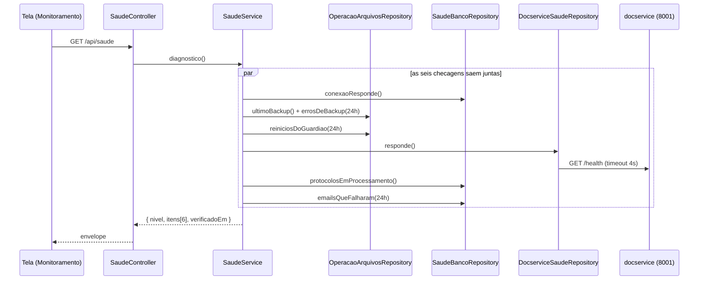
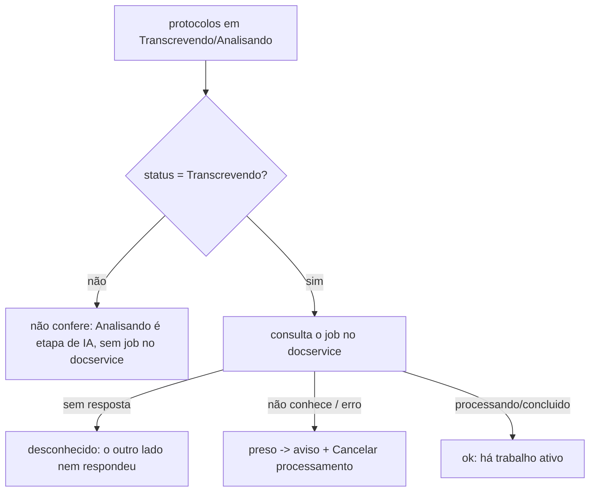
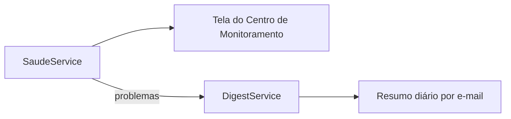

# Fluxo — `saude`

## Um diagnóstico, ponta a ponta

A tela carrega esse bloco **por conta própria**, não junto com o resto do Monitoramento:
uma das checagens é bater no docservice, que quando está fora só responde no timeout — e é
justamente aí que ela mais importa.

## Confirmação de transcrição presa

## O caminho até quem precisa saber

Dois canais de propósito. O primeiro serve a quem abre o painel; o segundo, a quem não
abre — que era exatamente o caso em todos os incidentes que motivaram o módulo.

## O que roda quando

| Momento | O que acontece |
|---|---|
| Alguém abre o Centro de Monitoramento | diagnóstico completo |
| Alguém clica em *Verificar agora* | diagnóstico completo, de novo |
| `MIGRACAO_DIGEST_HORA` (padrão 08:00) | `problemas()` entra no e-mail diário |

Nada é agendado por este módulo: ele não tem laço próprio nem grava histórico. É lido sob
demanda, e o único agendamento envolvido é o do digest, que já existia.
