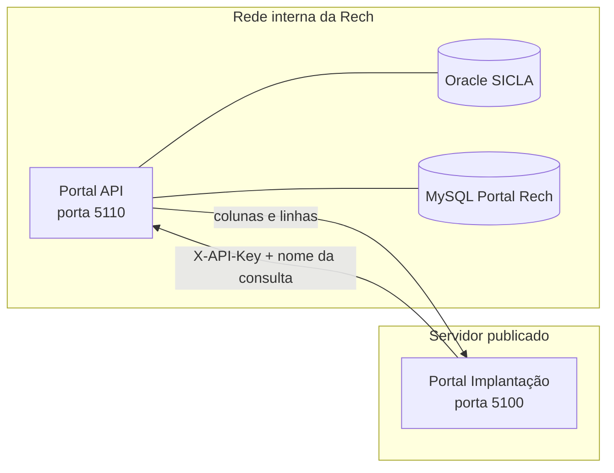
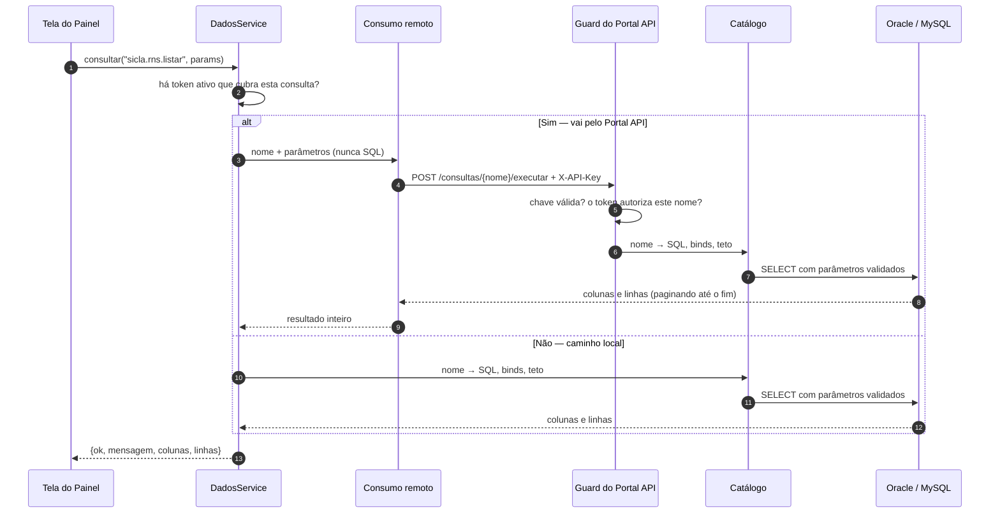

# Portal API — as duas instâncias

> O usuário chama a instância interna de **Portal API**. O arquivo continua com o nome
> antigo (`portal-conexoes.md`) para não quebrar os links já espalhados pelo repositório.

> Desenho definido pelo usuário em **2026-08-25**, para permitir publicar o Painel fora da
> rede da empresa sem levar junto nenhum dado de conexão com banco.
>
> Regra de origem (ADR-0003): *"Toda e qualquer consulta realizada em banco de dados terá uma
> API para comunicação."*
> Exigência que gerou este documento: *"Para que eu consiga liberar o painel para acesso
> externo da empresa, a conexão e leitura deve ser totalmente API. Não poderei deixar no
> portal e em lugar nenhum os dados de conexão com o banco."*

## O problema

O Painel é uma ferramenta interna que hoje roda na rede da Rech e abre conexão direta com o
Oracle do SICLA e o MySQL do Portal Rech. Publicá-lo num servidor em nuvem, do jeito que
está, significaria levar as credenciais desses bancos para uma máquina exposta à internet.
O risco não é o Painel: é o **banco de terceiro** atrás dele.

A resposta não é criptografar melhor o segredo — é **não ter o segredo lá**.

## O desenho

Duas instâncias, cada uma com uma função:

| | **Instância 1 — Portal API** | **Instância 2 — Portal Implantação** |
|---|---|---|
| Onde roda | rede **interna** da Rech | servidor em **nuvem** |
| Tem credencial de banco externo? | **sim**, é a única | **não**, nenhuma |
| O que expõe | `/api/dados/v1` + telas de administração | o Painel inteiro |
| Como fala com a outra | — | **token** (`X-API-Key`), pelo túnel |
| Porta padrão | **5110** (nunca publicada) | 5100 |
| Entrypoint | `dist/main-dados.js` (`Iniciar_Portal_Conexoes.bat`) | `dist/main.js` (`Iniciar_Painel_Novo.bat`) |
| Menu | 4 itens: Conexões · Consultas da API · Nova consulta · Tokens | o sistema inteiro |

O ganho não é de código — é de **superfície**. O processo que segura a senha do Oracle expõe
só a API de Dados, autenticação, permissões e health. Se a instância da nuvem for
comprometida, o que o invasor alcança é uma lista de consultas nomeadas, com parâmetros
tipados e teto de linhas. Não um banco.

Por isso a raiz de módulos da instância 1
([`backend/src/dados/dados-app.module.ts`](../backend/src/dados/dados-app.module.ts)) é curta
**de propósito**, e o teste `dados-app.module.spec.ts` recusa qualquer módulo novo ali: cada
módulo acrescentado é rota exposta na máquina que tem a senha do banco.

## O fluxo, de ponta a ponta



**Operação** — sete passos, uma vez por consulta. A ordem importa: sem consulta publicada não
há o que autorizar num token.

| # | Onde | O quê |
|---|---|---|
| 1 | Portal API · Conexões | Cadastra host/porta/banco/usuário/senha. A senha nunca volta à tela; em branco, mantém a atual. **Testar** roda `SELECT 1` — prova a credencial, não o privilégio nas views. |
| 2 | Portal API · Nova consulta | Cola o SELECT e clica em **Testar**: o sistema descobre os `:binds` e as colunas rodando com limite 1. Resta escolher o tipo de cada parâmetro e o teto. |
| 3 | Portal API · Nova consulta | **Publicar**. Só então a consulta entra no catálogo e pode ser autorizada. As validações estão logo abaixo. |
| 4 | Portal API · Tokens | Marca **exatamente as consultas** que o token pode chamar. A chave sai uma única vez, junto do endereço do portal. |
| 5 | Portal Implantação · Tokens da API de Dados | Cola endereço e token. O formato é conferido antes de qualquer ida à rede. |
| 6 | Portal Implantação · Testar | O Painel pergunta ao Portal API o catálogo **que aquele token enxerga** — já recortado. É dele que sai a lista de consultas. |
| 7 | Portal Implantação · Salvar | A chave vira **por consulta**: o que o token cobre passa a ir pelo Portal API; o resto continua local. |

**Execução** — nenhum módulo de negócio sabe se o dado veio de perto ou de longe.



Três garantias que valem mais que os desenhos: o **SQL nunca vem de quem chama**; o resultado
volta **inteiro**, paginado por baixo, para não truncar em silêncio uma consulta de teto alto;
e uma falha ao *decidir* o caminho cai no local — degrada o novo, nunca o que já funcionava.

## O menu de cada uma

Decisão do usuário em 2026-08-25: *"Quando falamos em Portal API, para conexão banco,
criação da API e geração do TOKEN, é apenas isso que deve ter dentro do painel. Nada mais é
preciso."*

O mesmo build do Angular serve as duas, e quem decide é o **backend**: `GET /api/instancia`
responde `painel` ou `portal-api`, o `main-dados.ts` se declara como o segundo, e o
`src/main.ts` do Angular **pergunta antes de a aplicação subir**.

Cada item do menu do Portal API é uma **rota própria** — o mesmo componente, com `secao` no
`data` dizendo qual parte renderizar. A primeira versão usava âncoras (`#conexoes`) na mesma
página, e o efeito era clicar em qualquer item e ver exatamente o mesmo conteúdo: âncora não é
navegação.

Não é o menu que é filtrado: é a **tabela de rotas** que é outra (`ROTAS_PORTAL_API` em
`app.routes.ts`). O que não está lá **não existe** naquele portal — não abre digitando o
endereço (cai em `/config/api-dados`) e o chunk nem é baixado. Esconder o item de menu foi a
primeira tentativa e não atendia ao pedido: *"os demais módulos não importa e não queremos que
tenha dentro do portal"*.

| | Portal API | Portal Implantação |
|---|---|---|
| Rotas | login, `/config/conexoes`, `/config/api-dados`, `/config/tokens`, `/config/api-dados/consulta[/:slug]`, `/config/consultas-bd[/:slug]`, `/perfil` | todas, **menos** as de administração da API |
| Endpoints de administração | `/api/dados/v1/admin/*` e `/api/config/consultas-bd` | **não existem** (404) |
| Menu | Conexões · Consultas da API · Nova consulta · Consultas BD · Tokens — **cada um a sua TELA** | completo, menos Consultas BD e API de Dados |
| Barra superior | sem busca de cliente, sem alertas | completa |
| Conexão com banco | **é aqui** | não existe |
| Vinculação de token | não existe | **é aqui** (Sistema → Tokens da API de Dados) |

No Portal Implantação sobrou **uma** tela de API de Dados: `Sistema → Tokens da API de
Dados`, onde se cola o token. Toda a administração saiu de lá em 2026-08-26 — *"o uso será
único e exclusivo no Portal API"*:

| Saiu do Painel | Onde está agora |
|---|---|
| `config/disponibilidade` (conexão Oracle) | **Conexões**, no Portal API |
| abas de conexão de Consultas BD | **Conexões**, no Portal API |
| `config/consultas-bd` | **Consultas BD**, no Portal API |
| `config/api-dados` (catálogo, clientes, uso) | **Consultas da API** e **Tokens**, no Portal API |

Os **Dashboards continuam no Painel** e continuam funcionando: o que mudou foi onde as
consultas são *editadas*, não onde são *usadas*.

Não é só a tela que sai: os **endpoints** de administração (`/api/dados/v1/admin/*` e
`/api/config/consultas-bd`) são declarados no `DadosAppModule`, e não no `DadosModule`. O
Painel monta o `DadosModule` — precisa do executor —, então deixá-los lá os manteria
alcançáveis por qualquer ADM com um JWT, sem tela mas vivos. No Painel eles respondem **404**.

> Isso obrigou o `DadosModule` a exportar `ClienteApiService` e `ConsultasPublicadasService`:
> um controller só resolve as dependências que o módulo dele enxerga. Sem isso o Portal API
> nem sobe — `UnknownDependenciesException` no boot, que é onde este tipo de erro aparece,
> porque nenhum teste de unidade monta a raiz da aplicação.

## Cadastrar a conexão (só no Portal API)

**Conexões**, na própria tela da API de Dados. A senha **nunca volta** para o navegador: o que
se vê é `temSenha`, e deixá-la em branco ao gravar mantém a atual. O **Testar** roda um
`SELECT 1` — prova a credencial, não o privilégio de leitura nas views; separar as duas coisas
é o que faz a mensagem de erro dizer a verdade.

Os dois **SELECTs da Disponibilidade** (ocupação e mapa de técnicos) também são editados aqui:
eles vivem na configuração da conexão, e vieram junto quando a tela de conexão saiu do Painel.

É o **único** lugar onde se cadastra conexão. As telas antigas do Painel foram removidas em
2026-08-26 — não há mais dois lugares para a mesma verdade.

## Colar o token (só no Portal Implantação)

**Sistema → Tokens da API de Dados**:

1. cole o endereço do Portal API e o token gerado lá;
2. **Testar** — o Painel pergunta ao Portal API o catálogo que *aquele token* enxerga, e ele
   já vem recortado. É daí que sai a lista de consultas; ninguém digita nome de consulta;
3. salve. A partir daí, as consultas que **esse token autoriza** deixam de abrir conexão com o
   banco e passam a ser pedidas ao Portal API, pelo nome.

O formato do token (`rd_<12 hex>_<48 hex>`) é conferido **antes** de a rede ser tocada: um
token incompleto ou com o rótulo colado junto é apontado como tal, com os tamanhos. E um `401`
que chegue do outro lado **não afirma mais** que o token foi revogado — daqui não dá para
distinguir isso de uma cópia pela metade ou de um endereço apontando para outra instância, e
as três possibilidades vão declaradas na mensagem.

A virada é **por consulta**, e é isso que a torna gradual e sem janela: o que o token não
cobre continua indo pelo caminho local. A própria tela mostra o que ainda falta cobrir — em
"Consultas sem token". Enquanto essa lista não zerar, este Painel ainda precisa de credencial
de banco e **não pode** ser publicado fora da rede.

O token fica gravado **inteiro** (não em hash), porque este lado precisa enviá-lo a cada
consulta — um segredo que se apresenta não pode ser de mão única. A consequência está
assumida e é o ponto do desenho: o que vaza numa invasão à instância publicada é o token, que
vale exatamente as consultas listadas. Não a credencial do Oracle. Revogar é um clique no
Portal API.

## O que a instância 2 nunca vê

- string de conexão, usuário e senha de banco;
- o **texto SQL** de qualquer consulta (o catálogo publica nome, parâmetros, colunas e teto —
  nunca o SQL: ele revelaria o schema do sistema de terceiro);
- qualquer endpoint que aceite SQL. **Não existe** — nem para o Administrador da nuvem.

## O token é por CONSULTA, não por conexão

Decisão do usuário. Um token autoriza **exatamente os nomes marcados** no cadastro. Um token
emitido para o painel de RNS não alcança o extrato de horas, mesmo sendo da mesma conexão —
há caso de teste e2e provando justamente isso.

Cadastro em **Sistema → API de Dados → Clientes de máquina**. A chave aparece **uma vez**, na
criação e na rotação: o banco guarda só o hash (bcrypt). Revogar preserva o histórico de uso;
apagar não.

O painel da chave nova mostra **o endereço desta instância junto do token**, cada um com um
botão **Copiar** — são exatamente os dois campos pedidos do outro lado. O botão não é conforto:
selecionar o token com o mouse é o jeito fácil de levar metade dele, e meio token volta do
outro lado como `401`, indistinguível de "token revogado" (foi o que aconteceu em
2026-08-26). Como as instâncias rodam em HTTP na rede interna, `navigator.clipboard` não
existe ali — o botão cai no `execCommand`, e avisa se nenhum dos dois valer, em vez de fingir
que copiou. Na tabela, o **prefixo fica mascarado** (`ab12••••`)
com um "mostrar" ao lado: ele não é segredo — viaja em claro dentro da chave e serve de índice
de busca —, mas material de credencial na tela é material de credencial na foto que alguém
tira da tela.

## Criar consulta pela TELA (sem release)

Também decisão do usuário: publicar consulta nova não pode depender de um deploy.

**Sistema → API de Dados → Nova consulta** (`/config/api-dados/consulta`):

1. escolha a conexão e cole o **SELECT**;
2. clique em **Testar** — a consulta roda com limite 1 e o sistema descobre sozinho os
   `:binds` que o texto cita e as **colunas** que o banco devolveu. Ninguém digita a lista de
   campos;
3. escolha o **tipo** de cada parâmetro (é ele que valida a entrada antes de chegar ao banco)
   e o **teto de linhas**;
4. marque **Publicar** para ela entrar no catálogo e poder ser autorizada num token.

Publicar exige contrato completo, e as checagens são as mesmas que o CI faz no catálogo de
código — aplicadas na hora de salvar, porque aqui não há PR:

- só `SELECT` (ou `WITH … SELECT`) — nada de DML/DDL;
- nome público no padrão `<origem>.<assunto>.<ação>`, e que **não colida** com o catálogo de
  código (em conflito, **o código vence** — consulta de tela não sequestra nome revisado);
- **bind × parâmetro casando exatamente**, nos dois sentidos;
- teto de linhas presente e dentro do limite (5.000 para consulta de tela; as de código vão a
  20.000 porque cada uma foi dimensionada e revisada).

Enquanto **não** publicada, a consulta é rascunho: serve aos Dashboards, como as que já
existiam, e não aparece no catálogo nem pode ser autorizada.

> ⚠️ **Pré-requisito duro:** o que este caminho **não** consegue garantir é *qual tabela* o
> SELECT lê — isso é privilégio do usuário no banco, não do nosso código. Criar consulta pela
> tela só é seguro com um usuário Oracle de **privilégio mínimo** (ver abaixo). Enquanto a
> conexão usar o `powerbi`, quem cria consulta na tela alcança tudo o que ele alcança.

## Pré-requisito: usuário Oracle de leitura mínima (`painel_ro`)

Auditoria de 2026-08-25 na credencial em uso (`powerbi`):

- privilégios de sistema: `SELECT ANY TABLE`, `SELECT ANY DICTIONARY`, `DROP ANY VIEW`,
  `CREATE PROCEDURE/TRIGGER/TABLE/…`; papéis `CONNECT, RESOURCE, SELECT_CATALOG_ROLE, SODA_APP`;
- alcance efetivo: **4.980 objetos em 39 schemas**;
- necessário pelas consultas do catálogo: **16 objetos**.

O pedido ao TI é criar `painel_ro` com `CREATE SESSION` e `SELECT` **apenas** nesses objetos,
sem `ANY`, sem `RESOURCE`, sem privilégio de escrita. Isso transforma o teto da instância 1 de
"o Oracle inteiro" em "16 views" — e é o que torna a criação de consulta pela tela um recurso
e não um risco.

## Subir a instância 1

```bat
Build_Painel_Novo.bat           :: compila backend + Angular (main-dados.js sai do mesmo build)
Iniciar_Portal_Conexoes.bat     :: sobe na 5110
```

Variáveis (de **usuário** do Windows, nunca no `.bat`):

| Variável | Para quê |
|---|---|
| `MIGRACAO_DB_URL` | `painel_novo` — clientes de API, consultas salvas, usuários |
| `MIGRACAO_JWT_SECRET` / `..._REFRESH_SECRET` | login de pessoa (as mesmas do Painel) |
| `MIGRACAO_DADOS_PORT` | porta (padrão **5110**) |
| `MIGRACAO_DADOS_CORS` | origem do Painel da nuvem, se ele chamar pelo navegador |

Administração no navegador, **só pela rede interna**:
`http://I7M1700-01-EVE:5110/config/api-dados`.

O **guardião** (`Guardiao_Painel_Novo.vbs`, Tarefa Agendada a cada 5 min) vigia a 5110 junto
com o Painel e o docservice, e a reergue se ela cair. Ele só o faz depois de o Portal API ter
subido ao menos uma vez nesta máquina (existir `portal_conexoes_stdout.log` na pasta de
backup) — numa máquina que não quer o Portal API, ele não fica tentando subi-lo para sempre.

> Isso entrou em 2026-08-26, um dia depois de a instância subir: ela caiu durante a noite e
> ninguém a reergueu, porque o guardião só conhecia as outras duas. Mesma falha do docservice
> em 2026-08-04. Serviço novo sem vigilância é serviço que some no primeiro reboot.

> Ela serve o **mesmo build** do Angular do Painel, mas só as telas da área Sistema → API de
> Dados funcionam ali — o resto do menu chama endpoints que este processo não expõe. É
> intencional: entre um menu completo e uma superfície pequena na máquina que tem a senha do
> banco, escolhemos a superfície pequena. O endereço de trabalho é `/config/api-dados`.

⚠️ **Firewall:** libere a 5110 **apenas** para o endereço do túnel. Ela nunca deve ser
publicada.

## O que ainda falta para as duas instâncias existirem de fato

O código das duas está pronto, o processo da instância 1 sobe e o consumo remoto funciona —
mas **as duas ainda rodam na mesma máquina**, e nenhum token está cadastrado, então o Painel
continua consultando o banco pelo próprio processo. Falta:

- [ ] **`painel_ro`** no Oracle (pedido ao TI) — pré-requisito do resto;
- [ ] **túnel** entre nuvem e rede interna (decisão do TI: VPN site-to-site, Cloudflare Tunnel
  ou equivalente) — a 5110 nunca fica exposta diretamente;
- [ ] **TLS** nas duas pontas (hoje o tráfego interno é HTTP puro);
- [ ] **inversão de confiança pendente:** hoje a instância interna lê as chaves *e o SQL
  editável* do mesmo `painel_novo` que o Painel administra. Se a nuvem passar a compartilhar
  esse banco, um comprometimento lá poderia reescrever `consultas_bd` e a instância interna
  executaria. Ou o `painel_novo` fica **na rede interna**, ou a instância 1 passa a ter banco
  próprio para catálogo e tokens.

## Onde está cada coisa

| Assunto | Arquivo |
|---|---|
| Decisão | [ADR-0003](<../vault/17 - ADR/ADR-0003 - API de Dados como fronteira unica de banco.md>) |
| Contrato da API | [`backend/src/dados/docs/api.md`](../backend/src/dados/docs/api.md) |
| Regras (tipos, tetos, autorização) | [`backend/src/dados/docs/regras-negocio.md`](../backend/src/dados/docs/regras-negocio.md) |
| Raiz da instância 1 | [`backend/src/dados/dados-app.module.ts`](../backend/src/dados/dados-app.module.ts) |
| Entrypoint | [`backend/src/main-dados.ts`](../backend/src/main-dados.ts) |
| Consumo remoto (lado Painel) | [`backend/src/dados/consumo/`](../backend/src/dados/consumo/dados-remoto.service.ts) |
| Perfil da instância | [`backend/src/common/instancia.ts`](../backend/src/common/instancia.ts) |
| Backlog | [`docs/pendencias.md`](pendencias.md) §API de Dados |
