# Banco de Dados

> [!info] Sobre esta seção
> Banco oficial MariaDB via TypeORM: migrations, seeds, constraints, índices, DER e
> dicionário de dados. Toda alteração estrutural deve atualizar o DER e o dicionário junto
> com o schema.

## Convenções observadas no schema real (levantado em 2026-07-19)

- **26 entidades** em `backend/src/database/entities/`, listadas em `ENTITIES`
  (`index.ts`) — lista única usada tanto em runtime (`DatabaseModule`) quanto pelo CLI de
  migrations, de propósito, para as duas nunca divergirem.
- **10 migrations** em `backend/src/database/migrations/`, escritas em SQL puro via
  `queryRunner.query(...)` (não `migration:generate` — comentário no código explica: sem
  Postgres/MariaDB de homologação disponível no momento).
- **Sem relação formal do TypeORM** (`@ManyToOne`/`@OneToMany`/`@JoinColumn`) em nenhuma
  entidade — toda referência é uma coluna simples (`projeto_id`, `modelo_id`,
  `usuario_id` etc.) com `@Index()`. Os relacionamentos abaixo são **lógicos**, inferidos
  pelo nome da coluna, não constraints do TypeORM.
- **Sem `FOREIGN KEY` no banco** — confirmado lendo as migrations em SQL puro: só
  `CREATE TABLE`/`CREATE INDEX`, nunca `REFERENCES`. Integridade referencial é
  responsabilidade da aplicação, não do banco.
- Datas de negócio (ex.: `data_inicio`, `data_encerramento`) são `varchar`, não `DATE` —
  espelha o formato texto livre do Flask original; `criado_em`/`atualizado_em` (auditoria)
  são `TIMESTAMP` de verdade.

## DER (relacionamentos lógicos)

```mermaid
erDiagram
    PROJETOS ||--o{ DESIGNACOES : "projeto_id"
    PROJETOS ||--o{ CRONOGRAMA_ATIVIDADES : "projeto_id"
    PROJETOS ||--o{ CRONOGRAMA_SLOTS : "projeto_id"
    PROJETOS ||--o| CRONOGRAMA_CONFIG : "projeto_id (unique)"
    PROJETOS ||--o{ CRONOGRAMA_PERIODOS_BLOQUEADOS : "projeto_id"
    PROJETOS ||--o{ CRONOGRAMA_ITENS : "projeto_id"
    PROJETOS ||--o{ CHECKLIST_ITENS : "projeto_id"
    PROJETOS ||--o{ LEVANTAMENTO_RESPOSTAS : "projeto_id"
    PROJETOS ||--o{ DOC_CONTEUDO : "projeto_id"
    PROJETOS ||--o{ DOCUMENTOS : "projeto_id"
    PROJETOS ||--o{ EVENTOS : "projeto_id"
    PROJETOS ||--o{ MODIFICACOES : "projeto_id"
    USUARIOS ||--o{ REFRESH_TOKENS : "usuario_id"
    MODELOS_DOCUMENTO ||--o{ MODELOS_DOCUMENTO_VERSOES : "modelo_id"
    MODELOS_DOCUMENTO ||--o{ MODELOS_DOCUMENTO_CAMPOS : "modelo_id"

    PROJETOS {
        int id PK
        varchar cliente
        varchar etapa
        varchar situacao
        varchar consultor
        varchar gci
    }
    USUARIOS {
        int id PK
        varchar login UK
        varchar perfil
        varchar codigo_sicla
        boolean ativo
    }
    MODELOS_DOCUMENTO {
        int id PK
        varchar slug
        varchar fase
        varchar tipo
        varchar arquivo
    }
```

**Catálogos/entidades independentes** (sem FK de/para outras tabelas — de propósito, são
referência global ou base de conhecimento própria): `checklist_modelo`, `indice_topicos`,
`modelos_email`, `consultas_bd`, `matriz_competencias`, `matriz_tecnicos`, `protocolos`,
`cadastros_pendentes`. `matriz_tecnicos` e `cadastros_pendentes` se relacionam com
`usuarios` só por **convenção de dado** (nome/código SICLA/e-mail), nunca por FK.

## Dicionário de dados

### Identidade / Autenticação

**`usuarios`** — conta de acesso ao painel.

| Coluna | Tipo | Observação |
| --- | --- | --- |
| id | serial PK | |
| login | varchar(120) | único (`IDX_usuarios_login`) |
| nome, email | varchar | |
| senha_hash | text | bcrypt (Flask usava werkzeug scrypt/pbkdf2 — reset exigido na virada) |
| perfil | varchar(20) | enum aplicacional `Perfil` |
| codigo_sicla | varchar(40) | elo com o Agendador de Visitas |
| ativo | boolean | default true |
| criado_em | timestamp | |

**`refresh_tokens`** — sessões revogáveis (logout real).

| Coluna | Tipo | Observação |
| --- | --- | --- |
| id | serial PK | |
| usuario_id | int, indexado | → `usuarios.id` (lógico) |
| token_hash | varchar(128) | único |
| expira_em | timestamp | |
| revogado | boolean | |
| criado_em | timestamp | |

### Núcleo do projeto

**`projetos`** — entidade central; uma linha por implantação de cliente.

| Coluna | Tipo | Observação |
| --- | --- | --- |
| id | serial PK | |
| cliente, cnpj, numero_projeto, numero_proposta, ramo | varchar | |
| responsavel, consultor, gci | varchar(160) | |
| etapa | varchar(40) | enum `Etapa`, default `Agendamento` |
| situacao | varchar(40) | enum `Situacao`, default `Em andamento` |
| data_inicio, data_levantamento, data_uso_oficial, data_encerramento | varchar(20) | texto livre, não `DATE` |
| horas_cobradas, horas_bonificadas | varchar(20) | |
| modulos, contatos, observacoes | text | |
| contato_nome, contato_email, contato_tel | varchar | |
| criado_em, atualizado_em | timestamp | |

### Agendador de Visitas (Cronograma — motor de agendamento)

**`designacoes`** — consultor responsável por módulo + ordem de treinamento.

| Coluna | Tipo | Observação |
| --- | --- | --- |
| id | serial PK | |
| projeto_id | int, indexado | → `projetos.id` |
| modulo, consultor, analista | varchar | `analista=""` usa o padrão do projeto |
| ordem | int | `0` = todos os módulos, cai na ordem alfabética |
| nao_distribuir | boolean | |

**`cronograma_slots`** (`SlotCronograma`) — horário de turno.

| Coluna | Tipo | Observação |
| --- | --- | --- |
| id | serial PK | |
| projeto_id | int, indexado | |
| data | varchar(10) | `""` = global, único valor usado hoje |
| turno, hora_inicio, hora_fim | varchar | |

**`cronograma_atividades`** (`AtividadeCronograma`) — visita/atividade agendada.

| Coluna | Tipo | Observação |
| --- | --- | --- |
| id | serial PK | |
| projeto_id | int, indexado | |
| modulo, turno, hora | varchar | |
| status | varchar(20) | default `Solicitada` |
| nova_data, novo_turno | varchar | reagendamento |
| origem_id | int | rastreia cópia/origem |
| is_copia, auto_agendado | boolean | |

**`cronograma_config`** — 1 linha por projeto, parâmetros da distribuição automática.

| Coluna | Tipo | Observação |
| --- | --- | --- |
| id | serial PK | |
| projeto_id | int, **único** | 1:1 com `projetos` |
| modo_disponibilidade | varchar(20) | `conjunta` \| `individual` |
| data_inicio | varchar(10) | `""` = hoje |
| dias_turnos_excluidos | varchar(200) | ex.: `0-manha,2-tarde` |
| analista_padrao | varchar(160) | |

**`cronograma_periodos_bloqueados`** — recesso/férias que bloqueia visitas.

| Coluna | Tipo | Observação |
| --- | --- | --- |
| id | serial PK | |
| projeto_id | int, indexado | |
| data_ini, data_fim | varchar(10) | |
| motivo | varchar(160) | |
| tecnicos | varchar(400) | vazio = vale para todos |

### Plano editável pós-geração (Cronograma/Check List como documento)

**`cronograma_itens`** (`CronogramaItem`) — linha editável do documento Cronograma
(distinto do motor de agendamento acima).

| Coluna | Tipo | Observação |
| --- | --- | --- |
| id | serial PK | |
| projeto_id | int, indexado | |
| ordem | int | |
| etapa, topicos | text | |
| horas | varchar(20) | |
| data | varchar(20) | formato `DD/MM/AAAA`, distinto de `AAAA-MM-DD` usado alhures |
| modalidade | varchar(40) | |
| status | varchar(30) | `Previsto`\|`Agendado`\|`Concluído`\|`Cancelado` |

**`checklist_itens`** (`ChecklistItem`) — linha editável do documento Check List.

| Coluna | Tipo | Observação |
| --- | --- | --- |
| id | serial PK | |
| projeto_id | int, indexado | |
| ordem | int | |
| modulo | varchar(80) | |
| item | text | |
| responsavel | varchar(160) | |
| status | varchar(30) | `Pendente`\|`Em andamento`\|`Concluído`\|`N/A` |
| obs | text | |

**`modificacoes`** — auditoria linha-a-linha do Cronograma/Check List.

| Coluna | Tipo | Observação |
| --- | --- | --- |
| id | serial PK | |
| projeto_id | int, indexado | |
| entidade | varchar(30) | `cronograma`\|`checklist` |
| ref, campo | varchar | ex.: `"linha 3"` / `"status"` |
| de, para | text | valor antes/depois |
| autor | varchar(120) | |
| criado_em | timestamp | |

### Documentos e Modelos

**`modelos_documento`** — 1 por fase (Levantamento/Projeto/Cronograma/Termo); `arquivo` é o
vigente.

| Coluna | Tipo | Observação |
| --- | --- | --- |
| id | serial PK | |
| slug, fase | varchar | |
| tipo | varchar(10) | `docx`\|`xlsx` |
| arquivo | varchar(200) | nome no store gravável |
| descricao | text | |
| ordem | int | |
| atualizado_em | timestamp | |

**`modelos_documento_versoes`** — histórico de arquivos de um modelo.

| Coluna | Tipo | Observação |
| --- | --- | --- |
| id | serial PK | |
| modelo_id | int, indexado | → `modelos_documento.id` |
| versao | int | |
| arquivo, autor | varchar | |
| motivo | text | |
| vigente | boolean | |
| criado_em | timestamp | |

**`modelos_documento_campos`** — mapa placeholder → origem (só informativo/exibição).

| Coluna | Tipo | Observação |
| --- | --- | --- |
| id | serial PK | |
| modelo_id | int, indexado | |
| ordem | int | |
| secao, placeholder, rotulo, origem | varchar | |
| obrigatorio | boolean | |
| observacao | text | |

**`documentos`** — documento gerado/anexado ao projeto (histórico).

| Coluna | Tipo | Observação |
| --- | --- | --- |
| id | serial PK | |
| projeto_id | int, indexado | |
| tipo, arquivo | varchar | |
| caminho | text | |
| origem | varchar(20) | `gerado`\|`importado` |
| criado_em | timestamp | |

**`doc_conteudo`** — campo estruturado do Levantamento/Projeto (fonte da geração fiel).

| Coluna | Tipo | Observação |
| --- | --- | --- |
| id | serial PK | |
| projeto_id | int, indexado | |
| doc | varchar(30) | `levantamento`\|`projeto` |
| campo | varchar(60) | |
| valor | text | |

**`eventos`** — timeline/histórico/auditoria do projeto.

| Coluna | Tipo | Observação |
| --- | --- | --- |
| id | serial PK | |
| projeto_id | int, indexado | |
| tipo | varchar(30) | `nota`\|`etapa`\|`documento`\|`email`\|`alerta` |
| descricao | text | |
| autor | varchar(120) | |
| criado_em | timestamp | |

### Levantamento (questionário de mapeamento)

**`indice_topicos`** — catálogo editável, fonte do seed de respostas por projeto.

| Coluna | Tipo | Observação |
| --- | --- | --- |
| id | serial PK | |
| ordem | int, indexado | |
| modulo_num, modulo_sigla, modulo | varchar | |
| adicional_num, adicional_sigla, adicional | varchar | |
| topico | text | |

**`levantamento_respostas`** — resposta do consultor por projeto (semeada do índice acima).

| Coluna | Tipo | Observação |
| --- | --- | --- |
| id | serial PK | |
| projeto_id | int, indexado | |
| ordem | int | |
| modulo_sigla, modulo, adicional | varchar | |
| topico, resposta | text | |

### Catálogos de sistema (independentes)

**`checklist_modelo`** — roteiro por módulo, fonte da agrupação em Visitas (campo `seq`).
Populado por seed a partir de `tools/data/checklist_modulos.yaml` (dado local, fora do git).

| Coluna | Tipo |
| --- | --- |
| id, ordem | PK / int indexado |
| modulo, adicional, tipo, golive, menu, seq | varchar |
| integracoes, item, acao | text |

**`modelos_email`** — template de e-mail com variáveis `{{VAR}}`.

| Coluna | Tipo | Observação |
| --- | --- | --- |
| id | serial PK | |
| slug | varchar(80) | único |
| nome, assunto | varchar | |
| corpo | text | |
| etapa | varchar(80) | tag opcional, sem enforcement |
| ativo, padrao | boolean | `padrao=true` não pode ser excluído |
| criado_em, atualizado_em | timestamp | |

**`consultas_bd`** — consulta SQL nomeada, base dos Dashboards genéricos.

| Coluna | Tipo | Observação |
| --- | --- | --- |
| id | serial PK | |
| slug | varchar(60) | único |
| nome | varchar(160) | |
| sql | text | |
| ordem | int | |
| coluna_data, coluna_situacao | varchar(120) | vazio = não é dashboard, só consulta nomeada |
| mostrar_grafico | boolean | |

### Matriz de Conhecimento

**`matriz_competencias`** — catálogo de competências por área.

| Coluna | Tipo |
| --- | --- |
| id, ordem | PK / int |
| sigla, area | varchar(80) |

**`matriz_tecnicos`** — notas por técnico (JSON blob, fiel ao original).

| Coluna | Tipo | Observação |
| --- | --- | --- |
| id | serial PK | |
| nome, setor, dias | varchar | casado a `usuarios` por nome/código, não FK |
| notas | text | JSON `{sigla: nota}`, default `'{}'` |
| atualizado_em, atualizado_por | timestamp / varchar | |

### Protocolos (base de conhecimento própria, não vinculada a projeto)

**`protocolos`** — registro gerado de vídeo de treinamento (transcrição → IA → revisão).

| Coluna | Tipo | Observação |
| --- | --- | --- |
| id | serial PK | |
| titulo, modulo, menu, assunto | varchar | |
| resumo, objetivo, quando_utilizar, pre_requisitos, passo_a_passo, configuracoes, dependencias, regras_negocio, pontos_atencao, exemplos | text | |
| assuntos_removidos, pendencias | text | auditoria do que a IA descartou / pontos p/ revisão humana |
| video_nome, video_caminho, video_origem | varchar/text | `sharepoint`\|`upload` |
| video_hash | varchar(40), indexado | dedup (nome+tamanho+1MB) |
| duracao_seg | int | |
| transcricao, texto_ia, historico | text | |
| status | varchar(30) | `Pendente`→...→`Aprovado`/`Reprovado / Ajustar`/`Erro` |
| log_erro | text | |
| responsavel, aprovador | varchar(120) | |
| criado_em, processado_em, aprovado_em | timestamp (nullable) | |

### Cadastro

**`cadastros_pendentes`** — auto-cadastro aguardando confirmação por e-mail (vira `Usuario`
perfil `Consultor` na confirmação).

| Coluna | Tipo | Observação |
| --- | --- | --- |
| id | serial PK | |
| nome, login | varchar(120) | |
| email | varchar(160), indexado | |
| senha_hash | text | |
| codigo_sicla | varchar(40) | |
| codigo | varchar(6) | código de confirmação |
| tentativas | int | |
| criado_em | timestamp | |

### Telemetria de agentes (novo, 2026-07-19)

**`agente_execucoes`** — registro real de execução de agente/subagente (ver [[14 - IA]]).
Migration `1784513666449-AgenteExecucao` (`migrations-mariadb/`, gerada via
`migration:generate` contra o banco real, não escrita à mão).

| Coluna | Tipo | Observação |
| --- | --- | --- |
| id | int PK auto_increment | |
| agente | varchar(60), indexado | nome do agente (`.claude/agents/`) |
| agente_pai_id | int, indexado, nullable | hierarquia — quem acionou este agente |
| tarefa | varchar(255) | |
| status | varchar(20) | `em_execucao`\|`concluido`\|`falhou` |
| resultado | text, nullable | resumo ao concluir |
| iniciado_em | datetime(6) | |
| concluido_em | datetime, nullable | |

## Relacionados no Vault

- [[03 - Backend]]
- [[02 - Arquitetura]]
- [[12 - DevOps]]

## Aponta para (conteúdo real do repositório)

- `../backend/src/database/entities/` (26 entidades, `index.ts` = lista única)
- `../backend/src/database/migrations/` (10 migrations, SQL puro)

## Status

DER e dicionário de dados completos gerados em 2026-07-19 a partir do código real (não
suposição). Ver [[00 - Dashboard]].
