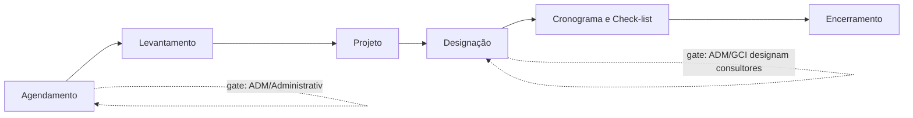
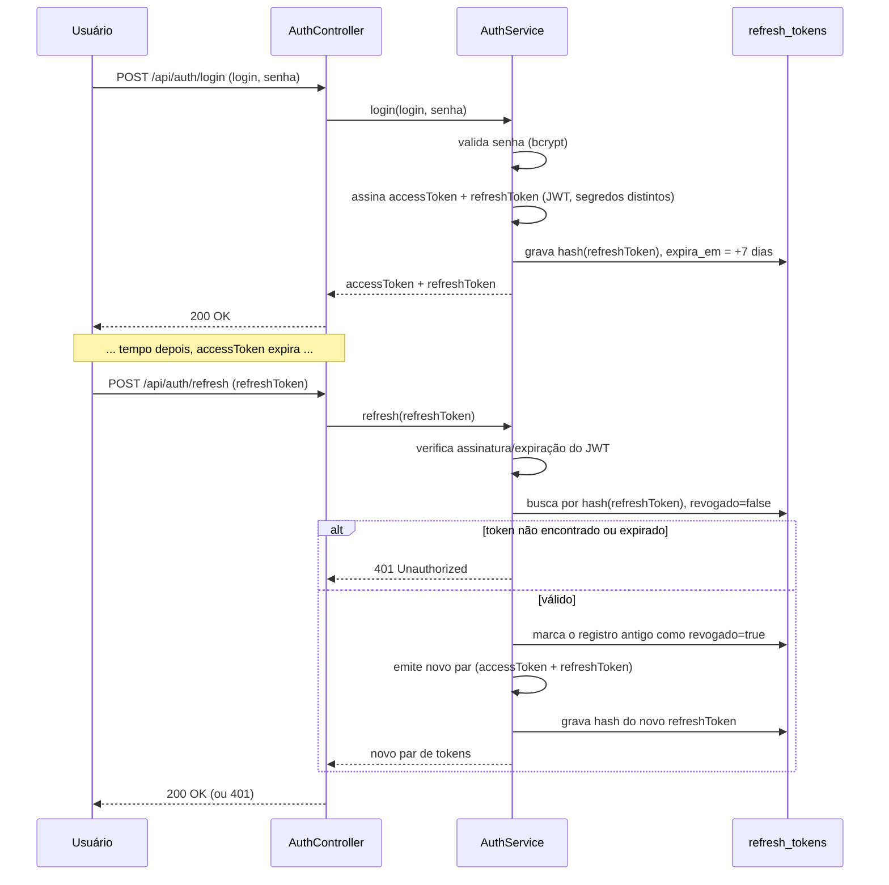

# Fluxogramas

> [!info] Sobre esta seção
> Diagramas de fluxo do processo e do sistema, em Mermaid, versionados junto do texto que
> descrevem. Gerados a partir do código real (`backend/src/common/constants/perfis.ts`,
> `auth.service.ts`, `app.module.ts`), não de suposição.

## 1. Etapas do Projeto (máquina de estados real)

`ETAPAS` em `common/constants/perfis.ts` — cada seta abaixo é hoje só uma transição de
dado (`projeto.etapa`), sem `FOREIGN KEY`/state machine formal no banco (ver
[[05 - Banco de Dados]]). Os gates de quem pode avançar cada etapa vêm de
`PERFIS_AGENDAMENTO`/`PERFIS_DESIGNA_CONSULTORES` no mesmo arquivo.

## 2. Autenticação — login e rotação de refresh token

Modelado a partir de `backend/src/auth/auth.service.ts` (código real, não simplificado):
o refresh token é **rotacionado** a cada uso (o antigo é revogado no mesmo request que
emite o par novo) para reduzir a janela de replay em caso de vazamento.

## 3. Módulos do backend (grafo de dependência real)

A partir dos `imports` de `backend/src/app.module.ts` — 19 módulos de feature mais
`DatabaseModule`, todos registrados direto no módulo raiz (não há sub-agrupamento em
"módulos de módulos"; é uma árvore rasa, não hierárquica).

```mermaid
graph TD
    App[AppModule] --> Database[DatabaseModule]
    App --> Auth[AuthModule]
    App --> Users[UsersModule]
    App --> Projetos[ProjetosModule]
    App --> Health[HealthModule]
    App --> Catalogos[CatalogosModule]
    App --> Cronograma[CronogramaModule]
    App --> Levantamento[LevantamentoModule]
    App --> Ia[IaModule]
    App --> Protocolos[ProtocolosModule]
    App --> Email[EmailModule]
    App --> Fluxo[FluxoModule]
    App --> Disponibilidade[DisponibilidadeModule]
    App --> Matriz[MatrizModule]
    App --> Painel[PainelModule]
    App --> Cadastro[CadastroModule]
    App --> Designacao[DesignacaoModule]
    App --> Digest[DigestModule]
    App --> PlanoCronograma[PlanoCronogramaModule]
    App --> Legado[LegadoModule]
```

## Relacionados no Vault

- [[09 - Casos de Uso]]
- [[02 - Arquitetura]]
- [[05 - Banco de Dados]]
- [[03 - Backend]]

## Aponta para (conteúdo real do repositório)

- `../backend/src/common/constants/perfis.ts`
- `../backend/src/auth/auth.service.ts`
- `../backend/src/app.module.ts`

## Status

Três diagramas reais gerados em 2026-07-19 (etapas, auth, dependência de módulos). Ver
[[00 - Dashboard]].
